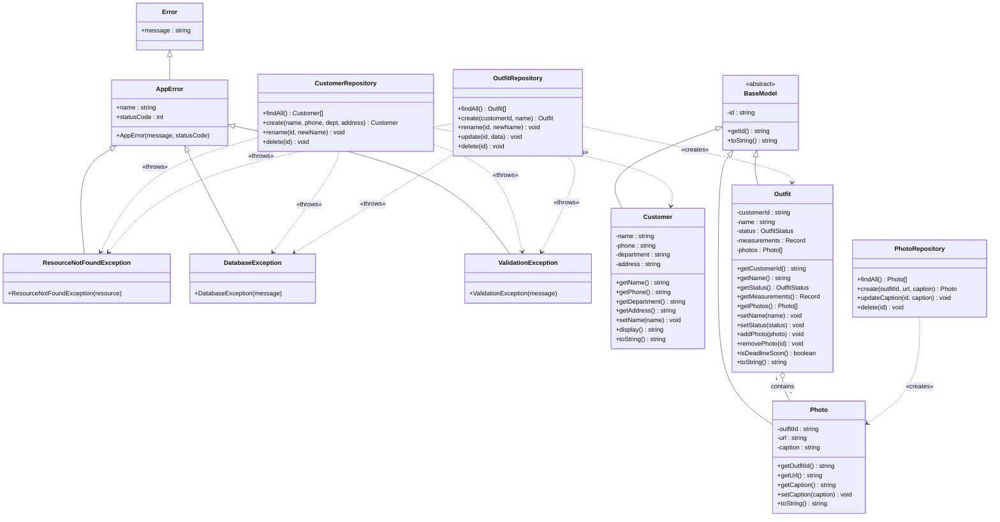

# Clothy — Class Diagram

---

## OOP Concepts ที่ปรากฏใน Diagram

| Concept | ตัวอย่างในโปรเจค |
|---|---|
| **Encapsulation** | ทุก field เป็น `private` (`#` ใน JS / `private` ใน TS), เข้าถึงผ่าน getter/setter เท่านั้น |
| **Inheritance** | `Customer`, `Outfit`, `Photo` extends `BaseModel` |
| **Inheritance (Error)** | `ResourceNotFoundException`, `DatabaseException`, `ValidationException` extends `AppError` extends `Error` |
| **Abstraction** | `BaseModel` เป็น abstract class บังคับ subclass ให้ implement `toString()` |
| **Polymorphism** | ทุก subclass override `toString()` และ `toJSON()` ต่างกัน |
| **Association** | `Outfit` มี `Photo[]` (Aggregation) |
| **Dependency** | Repository classes สร้าง Model objects และ throw Error objects |
